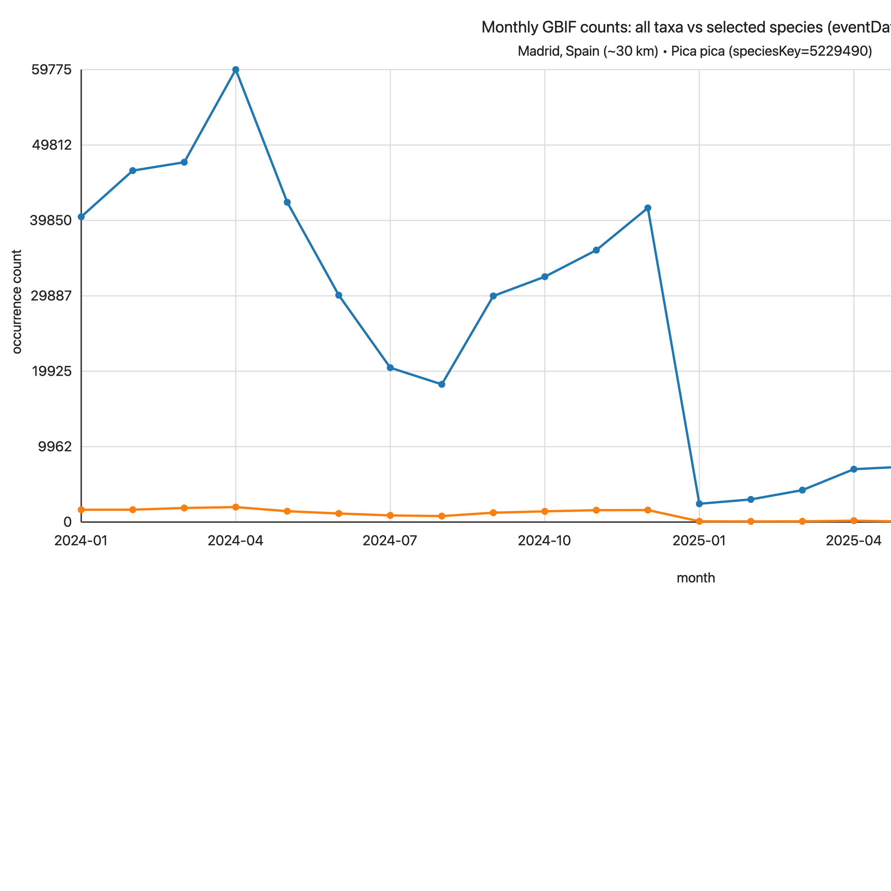
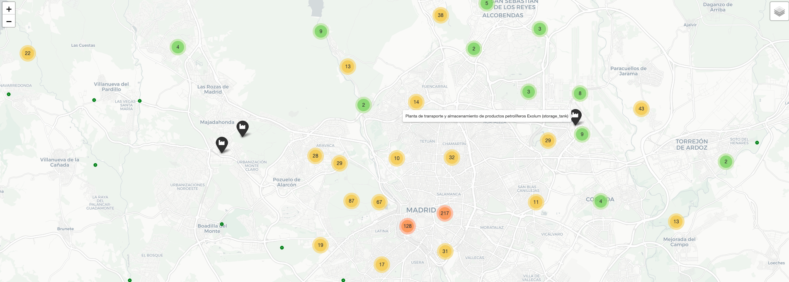
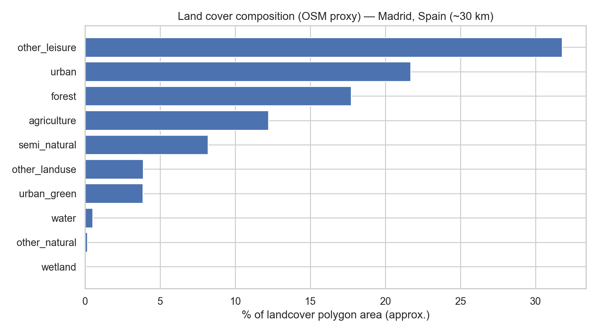

# GBIF Occurrence Data — README

## How to execute this project

### Setup (Python virtual environment)

From the repo root:

```bash
python -m venv .venv
source .venv/bin/activate
python -m pip install --upgrade pip
pip install -r requirements.txt
```

If you don’t have Jupyter installed already, install it:

```bash
pip install jupyterlab
```

Then start Jupyter:

```bash
jupyter lab
```

### Notebooks (recommended order)

- **`gbif_eda.ipynb`**: GBIF download/caching + EDA (missingness, time trends, licenses/provenance, monthly counts, Europe country counts, threatened species).
- **`oil_company_screening.ipynb`**: TNFD-style screening demo that combines GBIF occurrences with industrial assets (OpenStreetMap/Overpass), proximity metrics, and interactive mapping.
- **`biodiversity_gbif_profesor_demo.ipynb`**: additional demo notebook.

### Project structure (high level)

- **`data/`**: cached GBIF downloads (`.jsonl.gz`), derived CSVs, OSM asset cache, and exported HTML maps.
- **`pictures/`**: exported figures used in this README.
- **`requirements.txt`**: Python dependencies.

## Overview: what GBIF data is, how it’s published, and licensing

**GBIF (Global Biodiversity Information Facility)** is an open infrastructure that aggregates biodiversity data published by many organizations worldwide. The most common data product you’ll see in GBIF is an **occurrence record** — an observation or specimen record describing **what** was observed/collected, **where**, and **when** (plus lots of metadata).

### Important caveat: GBIF occurrence counts can “cliff drop”

When you query GBIF month-by-month (e.g. using `eventDate` windows and the API `count`), you may observe **sudden step changes** in the number of records returned for a region — even for **all taxa**.

This is **usually not evidence of a real ecological collapse**. In most cases it reflects **data availability and publishing/processing effects**, for example:
- a dominant **publisher/dataset** changes what it publishes into GBIF (pause, delay, scope change)
- **ingestion/processing cadence** (batch updates, backfills)
- shifts in **reporting effort** (platform usage, observer activity)

Example from this repo (Madrid ~30 km): “all taxa” and a single species show a sharp drop around 2025-01:



**Takeaway**: treat GBIF occurrence counts as a signal of *records in GBIF*, not a direct proxy for *population size*. Always validate with provenance (`datasetKey`, `institutionCode`, `references`) and, if needed, compare `eventDate` (observed) vs `lastInterpreted` (processed).

### Fast “prompting” for occurrences: `limit=0` counts (and richness estimates)

You don’t need to download rows to answer basic scoping questions like:
- **How many occurrence records exist** for a given filter set?
- **How does record volume compare** across regions/countries/time windows?

GBIF’s Occurrence Search API returns an exact **`count`** for a query even when `limit=0` (i.e., return no rows, only metadata).

#### What does “record count” mean in GBIF?

- **1 record = 1 occurrence record** (one published observation/specimen/event entry), not an aggregated statistic.
- `resp["count"] = N` means **N occurrence records** match your filters (country/bbox/taxon/date/etc.).
- This is **not** “number of animals/plants”. Repeated observations, duplicates, and reporting effort can strongly affect counts.
- Some records include **`individualCount`**, but it is often missing/inconsistent; GBIF’s `count` does **not** sum `individualCount`.

Practical example: count occurrences by **country** (ISO2), optionally restricted to records with coordinates and/or a time window:

```python
from pygbif import occurrences

resp = occurrences.search(
    country="ES",          # Spain (ISO2)
    hasCoordinate=True,    # optional
    eventDate=None,        # or "2024-01-01,2024-12-31"
    limit=0,               # count-only
)
total_records = resp["count"]
```

About **species richness (unique species)**:
- A pure `count` does **not** directly tell you richness.
- You can estimate richness by either:
  - downloading occurrences for the slice and counting unique `species`/`speciesKey` locally (exact for the downloaded set), or
  - using GBIF **facets** on `speciesKey` (useful for exploration, but it can be incomplete if you don’t retrieve all facet buckets).

Example of “prompting” with `limit=0`: compare **record volumes by country** (Europe example; `country=...` filter):


### Threatened species (IUCN Red List) in GBIF records

Many GBIF occurrence records include an `iucnRedListCategory` field. This lets you quickly flag **threatened** taxa in your slice.

Common IUCN category codes:
- **LC**: Least Concern
- **NT**: Near Threatened
- **VU**: Vulnerable
- **EN**: Endangered
- **CR**: Critically Endangered
- **EW**: Extinct in the Wild
- **EX**: Extinct
- **DD**: Data Deficient

Typical “threatened” set used in quick analyses: **VU / EN / CR** (sometimes also EW / EX).

Example from the Madrid (~30 km) slice in `gbif_eda.ipynb` (counts of records by `iucnRedListCategory`):
- **LC**: 1434  
- **MISSING**: 462  
- **NT**: 53  
- **EN**: 25  
- **VU**: 25  
- **DD**: 1  

From that same slice, the notebook flagged **50 threatened records** across **6 unique threatened species**, e.g.:
- `Oryctolagus cuniculus` (**EN**)
- `Aquila adalberti` (**EN**)
- `Macrochloa tenacissima` (**VU**)

#### Example threatened species in Madrid area: European rabbit


`Oryctolagus cuniculus` (European rabbit) — **Near threatened**, population **decreasing**.  
*(Status can vary by assessment scope/date; verify against the current IUCN assessment for your use case.)*

> Note: “Threatened” (IUCN) is not the same as “protected” (legal protection). Legal protection depends on jurisdiction (CITES/EU/national lists) and requires joining an external list to GBIF (ideally via `speciesKey`).

### Overlaying GBIF occurrences with industrial assets from OpenStreetMap (Overpass API)

In addition to biodiversity occurrences (GBIF), you can enrich the analysis with **nearby industrial assets** from **OpenStreetMap** via the **Overpass API**—for example:
- `man_made=storage_tank` (storage tanks)
- `landuse=industrial`, `industrial=*`, `power=*`, and other site/plant infrastructure tags

The notebook `oil_company_screening.ipynb` demonstrates a workflow where we:
- query OSM/Overpass for industrial features in the same city/radius area,
- extract their **coordinates** and basic metadata,
- plot them together with GBIF occurrence points on an interactive `folium` map,
- export the result to an HTML file you can open locally:
  - `data/oil_screening_map_madrid_spain_r30km.html`

Screenshot preview:



### Land cover composition from OpenStreetMap (proxy)

You can also use OpenStreetMap as a **land-cover proxy** by querying polygon features such as:
- `landuse=*`
- `natural=*`
- `leisure=*`

In `oil_company_screening.ipynb` we fetch these polygons via Overpass, map them into coarse classes (e.g., `urban`, `agriculture`, `forest`, …), and compute an **approximate % area** composition within the city-radius bounding box. This is useful for adding **habitat context** when interpreting GBIF occurrences and industrial-asset proximity.

Example (Madrid ~30 km; OSM proxy):



### How GBIF data is “published”

- **Publishers** (museums, research institutes, citizen science platforms, etc.) publish datasets to GBIF.
- A dataset is identified by a **`datasetKey`** (UUID). A dataset usually has dataset-level metadata (title, publisher, DOI, etc.).
- GBIF exposes occurrences via APIs (e.g. **Occurrence Search API**) and via download formats.

### Licensing: record-level, mixed, and important

GBIF occurrence data is commonly published under **Creative Commons** licenses. In practice:
- **Licensing is often carried at the record level**, via fields like **`license`** and **`rightsHolder`**.
- A single API response / download can contain records from **many datasets** (many `datasetKey`s) and therefore **mixed licenses**.
- The safest rule: **comply with the license on each record you reuse**, or **filter** your analysis to a license subset that fits your use case.

#### Common licenses you may see (examples)

- **CC BY-NC 4.0** (`.../licenses/by-nc/4.0/...`)
  - You can reuse and adapt the data **for non-commercial use only**.
  - You must provide **attribution** and indicate changes.
- **CC BY 4.0** (`.../licenses/by/4.0/...`)
  - Similar, but **commercial use is allowed**.
  - Attribution is still required.
- **CC0 1.0** (`.../publicdomain/zero/1.0/...`)
  - Public domain dedication: generally reusable without restrictions.

> Note: License URLs sometimes end with `.../legalcode` (full legal text). The human-readable summary is often the same URL without `/legalcode` (the “deed” page).

#### What “attribution” means (and what it does NOT mean)

**Attribution** means giving credit — **not paying**. Typically you should include:
- **Who**: rights holder / publisher (often `rightsHolder` and/or dataset publisher)
- **What**: dataset title / identifier (e.g. `datasetKey`) and what you used (e.g. “GBIF occurrence records”)
- **Source**: GBIF link and/or dataset DOI; optionally record-level `references` links
- **License**: license name + link (e.g. “CC BY‑NC 4.0”)
- **Changes**: note if you filtered/cleaned/aggregated the data

Minimal attribution template (adjust to your context):
> “Data: GBIF occurrence records for {area/time}. Licensed under {license}. Rights holders and source datasets as provided in the records (`rightsHolder`, `datasetKey`). Accessed via GBIF on {date}. Filtered/aggregated by the authors.”

---

This document also contains a practical reference for working with GBIF data programmatically. It describes:

1. **Input parameters** available for querying GBIF occurrence data using `pygbif.occurrences.search()`
2. **Output columns** commonly produced in GBIF’s **Simple download** formats (SIMPLE_CSV / SIMPLE_PARQUET), suitable for loading into pandas as a flat table.

> Sources: `pygbif` occurrence module documentation and GBIF download format documentation.  
> - `pygbif` Occurrence search docs: https://pygbif.readthedocs.io/en/latest/modules/occurrence.html  
> - GBIF download formats: https://techdocs.gbif.org/en/data-use/download-formats

---

## 1) Query interface: `pygbif.occurrences.search()` parameters

`pygbif.occurrences.search()` is a wrapper around the GBIF **Occurrence Search API**. It supports filtering occurrences by taxonomy, geography, time, dataset metadata, record quality, and more, and returns a paged response (`limit` + `offset`).

### 1.1 Taxonomy filters

- **`taxonKey`** *(int)*  
  GBIF backbone taxon identifier to search by (recommended for precise taxon filtering).

- **`kingdomKey`** *(int)*  
  Filter by kingdom classification key.

- **`phylumKey`** *(int)*  
  Filter by phylum classification key.

- **`classKey`** *(int)*  
  Filter by class classification key.

- **`orderKey`** *(int)*  
  Filter by order classification key.

- **`familyKey`** *(int)*  
  Filter by family classification key.

- **`genusKey`** *(int)*  
  Filter by genus classification key.

- **`subgenusKey`** *(int)*  
  Filter by subgenus classification key.

- **`scientificName`** *(str)*  
  Scientific name search using the GBIF backbone (includes matches to synonyms/included taxa).

---

### 1.2 Geography / spatial filters

- **`country`** *(str; ISO 3166-1 alpha-2)*  
  Two-letter country code where the occurrence was recorded (e.g., `"ES"`, `"US"`).

- **`continent`** *(str)*  
  One of: `africa`, `antarctica`, `asia`, `europe`, `north_america`, `oceania`, `south_america`.

- **`geometry`** *(str; WKT)*  
  Well-Known Text (WKT) geometry filter. Supports: `POINT`, `LINESTRING`, `LINEARRING`, `POLYGON`, `MULTIPOLYGON`.  
  **Note:** For polygons, GBIF expects counter-clockwise point order.

- **`decimalLatitude`** *(float or `"min,max"` str)*  
  Latitude in WGS84. Supports **range queries** using `"min,max"` (e.g., `"40.0,41.0"`).

- **`decimalLongitude`** *(float or `"min,max"` str)*  
  Longitude in WGS84. Supports **range queries** using `"min,max"` (e.g., `"-4.0,-3.0"`).

- **`hasCoordinate`** *(bool)*  
  If `True`, return only records with coordinates.

- **`hasGeospatialIssue`** *(bool)*  
  If `True`, only records with known geospatial issues; if `False`, only records without them; if unset, both.

- **`elevation`** *(int/str; supports ranges)*  
  Elevation in meters. Supports `"min,max"` range queries (e.g., `"0,2000"`).

- **`depth`** *(int/str; supports ranges)*  
  Depth in meters. Supports `"min,max"` range queries (e.g., `"0,200"`).

---

### 1.3 Time filters

- **`eventDate`** *(str; ISO 8601; supports ranges)*  
  Date/time of the event (recording/observation). Supports partial dates and ranges like `"1990,1991"`.

- **`year`** *(int or `"min,max"` str)*  
  Four-digit year; supports ranges like `"1990,1999"`.

- **`month`** *(int or `"min,max"` str)*  
  Month `1..12`; supports ranges like `"1,3"`.

- **`lastInterpreted`** *(str; ISO 8601; supports ranges)*  
  When GBIF last processed/interpreted the record; supports ranges.

---

### 1.4 Dataset / publisher filters

- **`datasetKey`** *(str; UUID)*  
  Dataset UUID (publisher dataset).

- **`publishingCountry`** *(str; ISO 3166-1 alpha-2)*  
  Publishing country (two-letter code) of the dataset/record.

- **`repatriated`** *(flag / bool-ish)*  
  Filter records where publishing country differs from the country of recording.

---

### 1.5 Record / collection metadata filters

- **`basisOfRecord`** *(str)*  
  Filter by record basis (e.g., `HUMAN_OBSERVATION`, `PRESERVED_SPECIMEN`, etc.).

- **`typeStatus`** *(str)*  
  Filter by type status (nomenclatural type information).

- **`institutionCode`** *(str)*  
  Filter by institution code/acronym.

- **`collectionCode`** *(str)*  
  Filter by collection code.

- **`catalogNumber`** *(str)*  
  Filter by collection/dataset catalog number.

- **`recordNumber`** *(int/str)*  
  Filter by the collector’s/observer’s record number.

---

### 1.6 People / attribution filters

- **`recordedBy`** *(str)*  
  Filter by the recorder/collector name.

- **`recordedByID`** *(str)*  
  Filter by recorder identifier (e.g., ORCID URI).

- **`identifiedByID`** *(str)*  
  Filter by identifier/determiner identifier (e.g., ORCID URI).

---

### 1.7 Quality / interpretation filters

- **`issue`** *(str or list[str])*  
  Filter by one or more GBIF issue codes (interpretation flags).

---

### 1.8 Media + establishment filters

- **`mediatype`** *(str)*  
  Filter by media type: `StillImage`, `MovingImage`, `Sound`.

- **`establishmentMeans`** *(str)*  
  Filter by establishment means (e.g., `INTRODUCED`, `INVASIVE`, `NATIVE`, etc.).

---

### 1.9 Free text search

- **`q`** *(str)*  
  A simple text query across indexed fields.

- **`spellCheck`** *(bool)*  
  If `True`, enables spellcheck suggestions for `q`.

---

### 1.10 Paging + returned fields

- **`limit`** *(int; default 300)*  
  Page size (records per request).

- **`offset`** *(int; default 0)*  
  Pagination offset.

- **`fields`** *(str or list[str])*  
  Field selection:
  - `"all"` (default): all fields available
  - `"minimal"`: minimal set (name, key, latitude, longitude)
  - list of specific fields (implementation-dependent; may vary by API evolution)

---

### 1.11 Faceting (aggregations)

Facets return summary counts by category, often used with `limit=0` to avoid downloading records.

- **`facet`** *(str or list[str])*  
  Facet fields (e.g., `country`, `basisOfRecord`, etc.)

- **`facetMincount`** *(int)*  
  Minimum count threshold to include a facet value.

- **`facetMultiselect`** *(bool)*  
  If `True`, returns counts for values not currently selected by filters.

---

### 1.12 `**kwargs` passthrough

- `pygbif` allows passing some **request-level options** (e.g., `timeout`) through `**kwargs`.  
  Common options include: `timeout`, `cookies`, `auth`, `allow_redirects`, `proxies`, `verify`, `stream`, `cert`.

---

## 2) Output schema: GBIF Simple download columns (flat table)

GBIF provides different download formats. The most convenient for pandas is **Simple CSV** or **Simple Parquet** (flat schema).

Below are commonly used columns included in these “simple” formats, grouped by theme.

> Note: If you instead build a DataFrame directly from `occurrences.search(...)[ "results" ]`, you may see additional nested fields not listed here. Simple formats are designed to be stable and flat.

---

### 2.1 Identifiers

- **`gbifID`** *(string)*  
  GBIF occurrence identifier (key), intended to be stable.

- **`datasetKey`** *(string; UUID)*  
  Dataset UUID containing the occurrence.

- **`occurrenceID`** *(string)*  
  Publisher-provided occurrence identifier (ideally globally unique).

---

### 2.2 Backbone taxonomy (interpreted by GBIF)

- **`kingdom`** *(string)* — Kingdom name (backbone-interpreted).  
- **`phylum`** *(string)* — Phylum name (backbone-interpreted).  
- **`class`** *(string)* — Class name (backbone-interpreted).  
- **`order`** *(string)* — Order name (backbone-interpreted).  
- **`family`** *(string)* — Family name (backbone-interpreted).  
- **`genus`** *(string)* — Genus name (backbone-interpreted).  
- **`species`** *(string)* — Species name (usually without authorship).  
- **`infraspecificEpithet`** *(string)* — Infraspecific epithet (if present).  
- **`taxonRank`** *(string)* — Rank of the most specific name used (e.g., SPECIES).  
- **`scientificName`** *(string)* — Interpreted scientific name (often includes authorship).

---

### 2.3 Verbatim taxonomy (publisher-provided)

- **`verbatimScientificName`** *(string)*  
  Scientific name exactly as provided by the publisher.

- **`verbatimScientificNameAuthorship`** *(string)*  
  Authorship exactly as provided (if present).

---

### 2.4 Administrative / place description

- **`countryCode`** *(string)*  
  ISO 3166-1 alpha-2 country code.

- **`stateProvince`** *(string)*  
  Administrative region (publisher-provided).

- **`locality`** *(string)*  
  Free-text locality description (publisher-provided).

---

### 2.5 Occurrence status / abundance

- **`occurrenceStatus`** *(string)*  
  Presence/absence-style status (controlled vocabulary).

- **`individualCount`** *(integer)*  
  Number of individuals for the record (if provided).

---

### 2.6 Publishing organization

- **`publishingOrgKey`** *(string; UUID)*  
  Publisher organization UUID.

---

### 2.7 Coordinates and coordinate quality

- **`decimalLatitude`** *(float)*  
  Latitude in WGS84.

- **`decimalLongitude`** *(float)*  
  Longitude in WGS84.

- **`coordinateUncertaintyInMeters`** *(float)*  
  Radius of uncertainty around coordinates.

- **`coordinatePrecision`** *(float)*  
  Coordinate precision (decimal representation).

---

### 2.8 Elevation / depth (interpreted fields)

- **`elevation`** *(float)*  
  Interpreted elevation in meters above sea level.

- **`elevationAccuracy`** *(float)*  
  Estimated uncertainty/error for elevation.

- **`depth`** *(float)*  
  Interpreted depth in meters below sea level.

- **`depthAccuracy`** *(float)*  
  Estimated uncertainty/error for depth.

---

### 2.9 Dates

- **`eventDate`** *(string)*  
  Event date/time as recorded/published (ISO 8601 style; can be partial).

- **`year`** *(integer)*  
  Extracted/recorded year.

- **`month`** *(integer)*  
  Extracted/recorded month.

- **`day`** *(integer)*  
  Extracted/recorded day.

---

### 2.10 Taxon keys (numeric identifiers)

- **`taxonKey`** *(integer)*  
  Backbone taxon key for the interpreted matched taxon (can represent a synonym concept).

- **`speciesKey`** *(integer)*  
  Backbone taxon key for the species-level concept.

---

### 2.11 Record type / collection metadata

- **`basisOfRecord`** *(string)*  
  Basis of record (GBIF vocabulary) such as `HUMAN_OBSERVATION`.

- **`institutionCode`** *(string)*  
  Institution code/acronym holding the record.

- **`collectionCode`** *(string)*  
  Collection code/acronym.

- **`catalogNumber`** *(string)*  
  Record number used within the dataset/collection.

- **`recordNumber`** *(string)*  
  Recorder/collector record number.

---

### 2.12 Identification / people

- **`identifiedBy`** *(string; often semicolon-separated list)*  
  People or agents who identified the taxon.

- **`dateIdentified`** *(string; ISO 8601 date)*  
  Date of identification/determination.

- **`recordedBy`** *(string; often semicolon-separated list)*  
  Person(s) or organization(s) who recorded the occurrence.

---

### 2.13 Rights / licensing

- **`license`** *(string)*  
  Usage license for the record (e.g., CC0, CC BY, CC BY-NC).

- **`rightsHolder`** *(string)*  
  Rights holder name (if provided).

---

### 2.14 Biological status / type material

- **`typeStatus`** *(structured / string)*  
  Nomenclatural type status (if applicable).

- **`establishmentMeans`** *(string / structured)*  
  Establishment means (native/introduced/invasive/etc.) if present.

---

### 2.15 Processing, issues, media

- **`lastInterpreted`** *(string; ISO 8601 date-time)*  
  Timestamp when GBIF last interpreted the record.

- **`mediaType`** *(string; often semicolon-separated list)*  
  Media types associated with the record (images, audio, etc.)

- **`issue`** *(string; often semicolon-separated list)*  
  GBIF interpretation issues flagged for the record (data quality flags).

---

## 3) Recommended workflow notes (for data science / big data)

- **For small pulls** (up to tens/hundreds of thousands of records):  
  `occurrences.search()` with pagination (`limit` + `offset`) works well.

- **For large pulls** (millions of records):  
  Prefer the GBIF **download** mechanism (server-side exports), then load SIMPLE_PARQUET or Darwin Core Archive locally.

- **For modeling**:  
  Use `hasCoordinate=True`, consider filtering out records with geospatial issues (`hasGeospatialIssue=False`), and include `coordinateUncertaintyInMeters` in quality screening.

- **Licensing**:  
  If you plan commercial use, ensure you respect record-level licenses and attribution requirements (especially CC BY and CC BY-NC).

---

## 4) Quick examples

### 4.1 Bounding box query (via lat/lon ranges)

```python
from pygbif import occurrences

resp = occurrences.search(
    decimalLatitude="40.0,41.0",
    decimalLongitude="-4.0,-3.0",
    hasCoordinate=True,
    limit=300,
    offset=0
)
