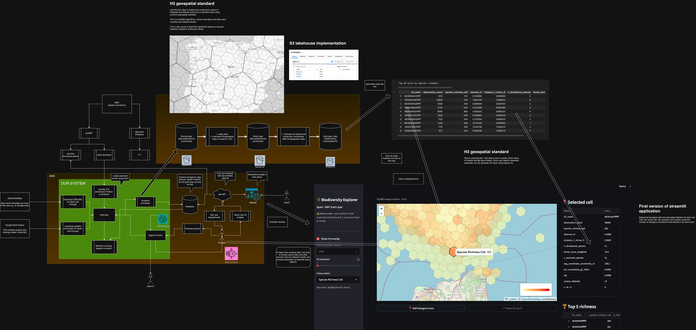

<p align="center">
  
</p>

<h1 align="center">HEXECO — Biodiversity Intelligence Platform</h1>

<p align="center"><em>A production-grade biodiversity data platform</em> that ingests GBIF occurrence data, enriches it with environmental and geospatial features, trains machine learning models for species prediction and invasive species classification, and delivers an interactive H3-based Biodiversity Explorer for Spain and Portugal.</p>

---

## Table of Contents

1. [Project Introduction](#project-introduction)
2. [Proposed Technical Architecture](#proposed-technical-architecture)
3. [H3 Geospatial Standard](#h3-geospatial-standard)
4. [Directory Structure](#directory-structure)
5. [Technology Stack](#technology-stack)
6. [Services & Components](#services--components)
7. [Data Pipeline & Datasets](#data-pipeline--datasets)
8. [Machine Learning](#machine-learning)
9. [Getting Started](#getting-started)
10. [GBIF Data Reference](#gbif-data-reference)

---

## Project Introduction

This capstone project delivers an **end-to-end biodiversity intelligence system** that transforms raw occurrence data from the Global Biodiversity Information Facility (GBIF) into actionable insights for conservation, policy, and research. The platform spans:

- **Data ingestion** — GBIF bulk downloads, OpenStreetMap (OSM), Google Earth Engine (GEE), Natura 2000, IUCN Red List
- **ETL pipeline** — Bronze → Silver → Gold lakehouse architecture on AWS S3
- **Spatial indexing** — Uber H3 hexagonal grid for uniform, hierarchical aggregation
- **Machine learning** — Species distribution prediction (XGBoost, LightGBM, MLP), invasive species image classification (EfficientNet-B0)
- **Interactive application** — Streamlit Biodiversity Explorer with H3 choropleth maps, species search, and IUCN profiles

**Geographic focus:** Spain and Portugal (Iberian Peninsula), with invasive species image classifier focused on the Galicia coast.

<p align="center">
  
</p>

**Use cases:** Conservation planning, Area of Habitat (AoH) mapping, invasive species early detection, TNFD-style biodiversity screening, species richness and threat hotspot analysis.

---

## Proposed Technical Architecture

The system follows a **lakehouse** design: raw data flows through Bronze, Silver, and Gold layers, with H3 as the unifying spatial index. Processed data feeds ML models and the Streamlit app.

<p align="center">
  
</p>

### Architecture Overview

| Component | Description |
|-----------|-------------|
| **Data Sources** | GBIF (species occurrences), OpenStreetMap (infrastructure, land use), Google Earth Engine (terrain, land cover), Natura 2000 (protected areas), IUCN Red List (threat assessments) |
| **Bronze Layer** | Raw GBIF downloads (SIMPLE_PARQUET), enriched with IUCN threat flags and invasive/introduced status. Stored in `s3://ie-datalake/bronze/gbif/` |
| **Silver Layer** | Cleaned coordinates, H3 indices at resolutions 6–9. Stored in `s3://ie-datalake/silver/gbif/` |
| **Gold Layer** | Cell-level biodiversity metrics (`gbif_cell_metrics`), species dimension and H3 mapping (`gbif_species_dim`, `gbif_species_h3_mapping`), OSM hex features (`osm_hex_features`), Natura 2000 protection (`nature2000_cell_protection`), GEE terrain (`gee_hex_terrain`), IUCN profiles (`iucn_species_profiles`) |
| **S3 Lakehouse** | All layers stored as snappy-compressed Parquet, partitioned by `country`, `year`, and `h3_resolution` |
| **ML & Analytics** | DuckDB for feature generation; XGBoost/LightGBM/MLP for species prediction; EfficientNet-B0 for invasive species image classification |
| **Biodiversity Explorer** | Streamlit app with Folium map, H3 overlay, species richness and threat metrics, species search with IUCN rationale |

### Data Flow

```
GBIF API (occurrences)  →  Bronze  →  Silver (H3 index)  →  Gold (metrics, species mapping)
OSM PBF                 →  Bronze  →  Silver (features)  →  Gold (osm_hex_features)
GEE                     →  Gold (gee_hex_terrain)
Natura 2000             →  Gold (nature2000_cell_protection)
IUCN API                →  Silver  →  Gold (iucn_species_profiles)
```

---

## H3 Geospatial Standard

### What Is H3?

**H3** is Uber's [hierarchical hexagonal grid system](https://h3geo.org/) for indexing the Earth's surface. It provides a **global, discrete, hierarchical, and equal-area** grid that simplifies spatial analysis and visualization.

### Why We Use H3

| Advantage | Explanation |
|-----------|-------------|
| **Uniform analysis** | Hexagons have equal area at each resolution, avoiding the distortion of lat/lon grids near the poles |
| **Hierarchical** | Coarser resolutions are parents of finer ones (`h3.cell_to_parent`). One index encodes multiple zoom levels |
| **Discrete** | Every point maps to exactly one cell. No overlapping polygons or edge effects |
| **ML-friendly** | H3-indexed locations can be used as categorical features; no need for continuous lat/lon in models |
| **Consistent joins** | All datasets (GBIF, OSM, GEE, Natura 2000) share the same `h3_index` key for fast spatial joins |

### H3 Resolutions in This Project

| Resolution | Approx. area per hex | Use case |
|------------|----------------------|----------|
| **9** | ~0.1 km² | Fine-grained point lookup, individual habitat patches |
| **8** | ~0.7 km² | Neighbourhood scale |
| **7** | ~5 km² | Local area (municipality); **primary for ML** |
| **6** | ~36 km² | Regional scale (county, comarca) |

### How H3 Is Used

1. **Silver layer:** Each occurrence gets `h3_9` from `(lat, lon)` via `h3.latlng_to_cell`. Coarser resolutions derived with `h3.cell_to_parent(h3_9, res)`.
2. **Gold layer:** Metrics aggregated per `(h3_index, h3_resolution, country, year)`.
3. **Streamlit:** Map zoom level selects resolution (6 or 7 in demo mode).
4. **Species predictor:** Training and prediction at resolution 7 (~5 km²) for Spain.

---

## Directory Structure

<p align="center">
  
</p>

```
ie-microsoft-capstone/
├── src/                          # ETL pipeline (Bronze → Silver → Gold)
│   ├── gbif_etl_job.ipynb        # Bronze: GBIF download + IUCN/invasive enrichment
│   ├── gbif_bronze_to_silver.ipynb
│   ├── gbif_silver_to_gold.ipynb
│   ├── gbif_silver_to_gold_dim.ipynb
│   ├── iucn_species_enrichment.ipynb
│   ├── iucn_silver_to_gold.ipynb
│   ├── notebooks/                # OSM, GEE, Natura2000, gold→PostgreSQL
│   └── README.md
├── gbif_species_predictor/        # ML species distribution prediction
│   ├── 01_species_predictor.ipynb
│   ├── 02_species_showcase_map.ipynb
│   ├── 03_area_of_habitat.ipynb
│   ├── output/                   # XGBoost model, AoH maps, SHAP
│   └── README.md
├── gbif_deep_learning/           # Invasive species image classifier
│   ├── 01_data_collection.ipynb
│   ├── 02_train_classifier.ipynb
│   ├── 03_species_in_bbox.ipynb
│   ├── app/                      # Streamlit inference app
│   ├── models/                   # EfficientNet checkpoint, confusion matrix
│   └── README.md
├── streamlit/                    # Biodiversity Explorer (main app)
│   ├── app.py
│   ├── requirements.txt
│   └── README.md
├── eda/                          # Exploratory notebooks
│   ├── gbif_eda.ipynb
│   ├── oil_company_screening.ipynb
│   └── biodiversity_gbif_profesor_demo.ipynb
├── iucn_enrichment/              # IUCN API cache, species profiles
├── bio_agent/                    # AI agent tools
├── data/                         # Cached downloads, OSM, GEE
├── pictures/                     # Exported figures
├── proposed_tech_architecture.png
├── requirements.txt
└── README.md
```

---

## Technology Stack

| Layer | Technologies |
|-------|--------------|
| **Data processing** | Python, Pandas, PyArrow, DuckDB |
| **Geospatial** | H3, GeoPandas, Shapely, Folium |
| **Cloud** | AWS S3 (`ie-datalake`), boto3, s3fs |
| **ETL** | Jupyter notebooks, PyArrow native S3 |
| **ML** | XGBoost, LightGBM, PyTorch, scikit-learn, SHAP |
| **Deep learning** | PyTorch, torchvision (EfficientNet-B0), OpenCV |
| **Web** | Streamlit, streamlit-folium |
| **APIs** | pygbif (GBIF), IUCN Red List API |

---

## Services & Components

### 1. ETL Pipeline (`src/`)

| Notebook | Purpose |
|----------|---------|
| `gbif_etl_job.ipynb` | Download GBIF SIMPLE_PARQUET by country/year; enrich with IUCN threat and invasive flags |
| `gbif_bronze_to_silver.ipynb` | Clean coordinates; add H3 indices (res 6–9) |
| `gbif_silver_to_gold.ipynb` | Aggregate to cell metrics (species richness, Shannon, threat counts, DQI) |
| `gbif_silver_to_gold_dim.ipynb` | Build species dimension and H3–species mapping |
| `iucn_species_enrichment.ipynb` | Fetch IUCN Red List assessments for threatened species |
| `iucn_silver_to_gold.ipynb` | Convert IUCN JSON → Parquet |

See [`src/README.md`](src/README.md) for full pipeline documentation.

### 2. Biodiversity Explorer (`streamlit/`)

Interactive map for exploring H3-based biodiversity metrics over Spain:

- **Map tab:** Folium map with H3 hex overlay; colour by species richness, Shannon diversity, threatened species count, etc.
- **Analysis tab:** Species per selected hex; IUCN rationale for threatened species
- **Species map tab:** Search by name → map of H3 cells where species occurs; IUCN panel when threatened

Run: `streamlit run streamlit/app.py`

See [`streamlit/README.md`](streamlit/README.md).

### 3. Species Predictor (`gbif_species_predictor/`)

Multi-label ML system predicting which **threatened species** (IUCN CR, EN, VU) are likely present in an H3 cell. Uses OSM, GEE terrain, land cover, and Natura 2000 features. Produces **Area of Habitat (AoH-proxy)** maps.

Models: XGBoost (primary), LightGBM, MLP, K-NN. Best macro PR-AUC ~0.316 (XGBoost).

See [`gbif_species_predictor/README.md`](gbif_species_predictor/README.md).

### 4. Invasive Species Image Classifier (`gbif_deep_learning/`)

EfficientNet-B0 transfer learning on GBIF images. Classifies 6 invasive plant species + 1 non-invasive class. ~81% validation accuracy. Includes Streamlit inference app.

See [`gbif_deep_learning/README.md`](gbif_deep_learning/README.md).

---

## Data Pipeline & Datasets

### Gold Layer (S3 `ie-datalake`)

| Dataset | Path | Description |
|---------|------|-------------|
| **gbif_cell_metrics** | `gold/gbif_cell_metrics/` | Per-hex biodiversity metrics: observation_count, species_richness_cell, shannon_H, n_threatened_species, threat_score_weighted, dqi, etc. |
| **gbif_species_dim** | `gold/gbif_species_dim/` | Species lookup: taxon_key, species_name, occurrence_count, is_threatened, is_invasive |
| **gbif_species_h3_mapping** | `gold/gbif_species_h3_mapping/` | Hex–species occurrence mapping for region lookups and per-species maps |
| **osm_hex_features** | `gold/osm_hex_features/` | OSM-derived features per hex: road_count, building_area_pct, protected_area_pct, human_footprint_area_pct, etc. |
| **nature2000_cell_protection** | `gold/nature2000_cell_protection/` | Natura 2000: is_protected_area, nearest_protected_distance |
| **gee_hex_terrain** | `gold/gee_hex_terrain/` | Elevation, slope, land cover (Copernicus CGLS) from Google Earth Engine |
| **iucn_species_profiles** | `gold/iucn_species_profiles/` | IUCN Red List profiles: rationale, habitat, threats, conservation |

### Join Example

```sql
SELECT g.h3_index, g.species_richness_cell, g.n_threatened_species,
       o.protected_area_pct, o.road_count_per_km2, n.is_protected_area
FROM gbif_cell_metrics g
JOIN osm_hex_features o ON g.h3_index = o.h3_index AND g.h3_resolution = o.h3_resolution
LEFT JOIN nature2000_cell_protection n ON g.h3_index = n.h3_id
WHERE g.country = 'ES' AND g.year = 2024 AND g.h3_resolution = 7;
```

---

## Machine Learning

### Species Distribution Prediction

<p align="center">
  
</p>

- **Target:** Top 10 threatened species (IUCN CR/EN/VU) + Lanius meridionalis (Southern Grey Shrike)
- **Features:** 40 environmental features (OSM, GEE terrain/land cover, Natura 2000)
- **Split:** Spatial block split (H3 resolution 5) to avoid autocorrelation
- **Models:** XGBoost (best), LightGBM, MLP, K-NN
- **Output:** Top-N species with probabilities per hex; AoH-proxy maps

### Invasive Species Image Classification

- **Target:** 6 invasive plant species + non-invasive class (Galicia coast)
- **Architecture:** EfficientNet-B0, transfer learning from ImageNet
- **Data:** GBIF occurrence images, quality-filtered (sharpness, size, aspect ratio)
- **Output:** Class probabilities, Grad-CAM interpretability

---

## Getting Started

### Setup

```bash
python -m venv .venv
source .venv/bin/activate
pip install -r requirements.txt
pip install jupyterlab
```

### Credentials

- **GBIF:** Set `GBIF_USER`, `GBIF_PWD`, `GBIF_EMAIL` in `.env` (for download jobs)
- **IUCN:** Set `IUCN_API_KEY` in `.env` (for species enrichment)
- **AWS:** `aws sso login --profile 486717354268_PowerUserAccess`

### Run Order

1. **ETL:** `gbif_etl_job.ipynb` → `gbif_bronze_to_silver.ipynb` → `gbif_silver_to_gold.ipynb` → `gbif_silver_to_gold_dim.ipynb`
2. **Streamlit:** `streamlit run streamlit/app.py`
3. **Species predictor:** `gbif_species_predictor/01_species_predictor.ipynb`
4. **Invasive classifier:** `gbif_deep_learning/01_data_collection.ipynb` → `02_train_classifier.ipynb`

---

## GBIF Data Reference

The sections below provide a practical reference for working with GBIF data: overview, caveats, API parameters, output schema, and licensing.

### Overview: What GBIF Data Is

**GBIF (Global Biodiversity Information Facility)** is an open infrastructure that aggregates biodiversity data published by many organizations worldwide. The most common data product is an **occurrence record** — an observation or specimen record describing **what** was observed, **where**, and **when** (plus metadata).

### Important Caveat: GBIF Occurrence Counts Can "Cliff Drop"

When you query GBIF month-by-month (e.g. using `eventDate` windows and the API `count`), you may observe **sudden step changes** in the number of records returned — even for **all taxa**. This is usually **not evidence of a real ecological collapse**. In most cases it reflects **data availability and publishing/processing effects** (publisher changes, ingestion cadence, reporting effort).

**Takeaway:** Treat GBIF occurrence counts as a signal of *records in GBIF*, not a direct proxy for *population size*.

### Fast "Prompting" for Occurrences: `limit=0` Counts

You don't need to download rows to answer basic scoping questions. GBIF's Occurrence Search API returns an exact **`count`** for a query even when `limit=0`.

```python
from pygbif import occurrences
resp = occurrences.search(country="ES", hasCoordinate=True, limit=0)
total_records = resp["count"]
```

### Threatened Species (IUCN Red List) in GBIF

Many GBIF records include `iucnRedListCategory`. Common codes: LC, NT, VU, EN, CR, EW, EX, DD. Typical "threatened" set: **VU / EN / CR**.

### Overlaying GBIF with OSM Industrial Assets

The notebook `oil_company_screening.ipynb` demonstrates querying OSM/Overpass for industrial features (storage tanks, power plants, etc.) and plotting them with GBIF occurrences on an interactive Folium map.

### Licensing

GBIF data is commonly published under **Creative Commons** licenses. Licensing is often **record-level**; a single response can contain **mixed licenses**. Comply with the license on each record, or filter to a license subset. Common: CC BY-NC 4.0, CC BY 4.0, CC0 1.0.

**Attribution** means giving credit — not paying. Include: rights holder, dataset title/identifier, GBIF link, license name, and note any filtering/aggregation.

---

## Query Interface: `pygbif.occurrences.search()` Parameters

### Taxonomy Filters

- **`taxonKey`** — GBIF backbone taxon identifier (recommended for precise filtering)
- **`kingdomKey`**, **`phylumKey`**, **`classKey`**, **`orderKey`**, **`familyKey`**, **`genusKey`**
- **`scientificName`** — Scientific name search (includes synonyms)

### Geography / Spatial Filters

- **`country`** — ISO 3166-1 alpha-2 (e.g. `"ES"`, `"PT"`)
- **`continent`** — africa, antarctica, asia, europe, north_america, oceania, south_america
- **`geometry`** — WKT geometry (POINT, POLYGON, MULTIPOLYGON)
- **`decimalLatitude`**, **`decimalLongitude`** — Range queries: `"40.0,41.0"`
- **`hasCoordinate`** — Only records with coordinates
- **`hasGeospatialIssue`** — Filter by geospatial issues

### Time Filters

- **`eventDate`** — ISO 8601, supports ranges
- **`year`**, **`month`** — Supports ranges
- **`lastInterpreted`** — When GBIF last processed the record

### Other Filters

- **`datasetKey`**, **`publishingCountry`**
- **`basisOfRecord`** — HUMAN_OBSERVATION, PRESERVED_SPECIMEN, etc.
- **`establishmentMeans`** — NATIVE, INTRODUCED, INVASIVE, etc.
- **`mediatype`** — StillImage, MovingImage, Sound
- **`limit`**, **`offset`** — Paging
- **`facet`** — Aggregations (e.g. `country`, `speciesKey`)

---

## Output Schema: GBIF Simple Download Columns

Key columns in SIMPLE_CSV / SIMPLE_PARQUET:

| Theme | Columns |
|-------|---------|
| **Identifiers** | gbifID, datasetKey, occurrenceID |
| **Taxonomy** | kingdom, phylum, class, order, family, genus, species, scientificName, taxonRank |
| **Place** | countryCode, stateProvince, locality |
| **Coordinates** | decimalLatitude, decimalLongitude, coordinateUncertaintyInMeters |
| **Dates** | eventDate, year, month, day |
| **Keys** | taxonKey, speciesKey |
| **Record** | basisOfRecord, institutionCode, collectionCode |
| **Rights** | license, rightsHolder |
| **Status** | establishmentMeans, individualCount |

---

## Recommended Workflow

- **Small pulls** (up to hundreds of thousands): `occurrences.search()` with pagination
- **Large pulls** (millions): Use GBIF **download** API (server-side exports), then load SIMPLE_PARQUET
- **Modeling:** Use `hasCoordinate=True`, consider `hasGeospatialIssue=False`, include `coordinateUncertaintyInMeters` in quality screening
- **Licensing:** For commercial use, respect record-level licenses and attribution

---

*Sources: [pygbif docs](https://pygbif.readthedocs.io/), [GBIF download formats](https://techdocs.gbif.org/en/data-use/download-formats)*
