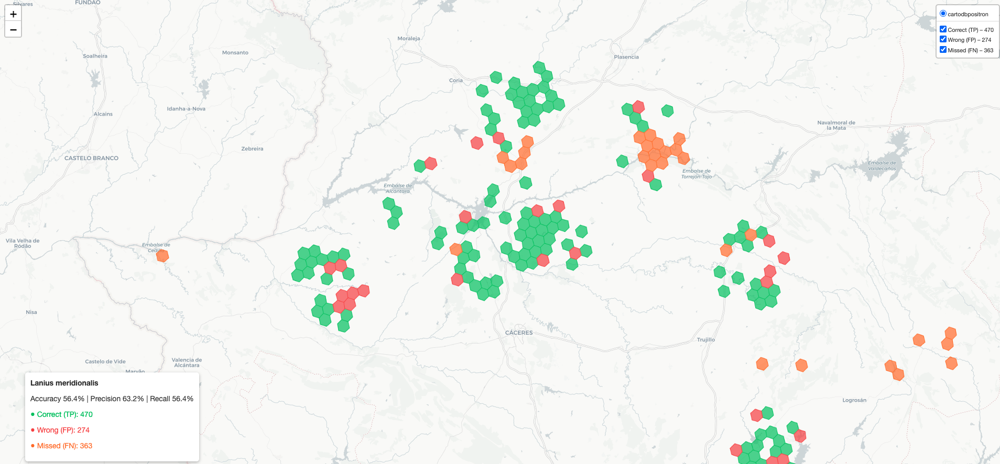
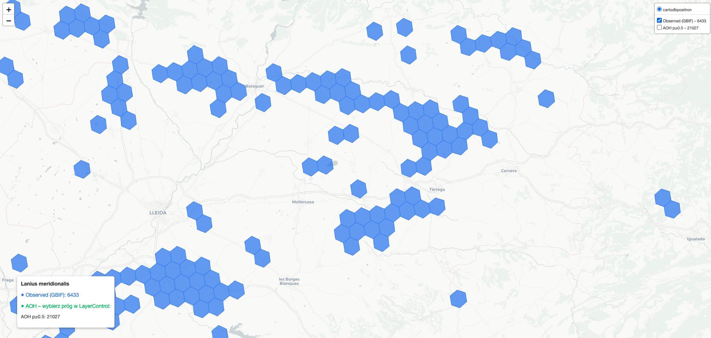
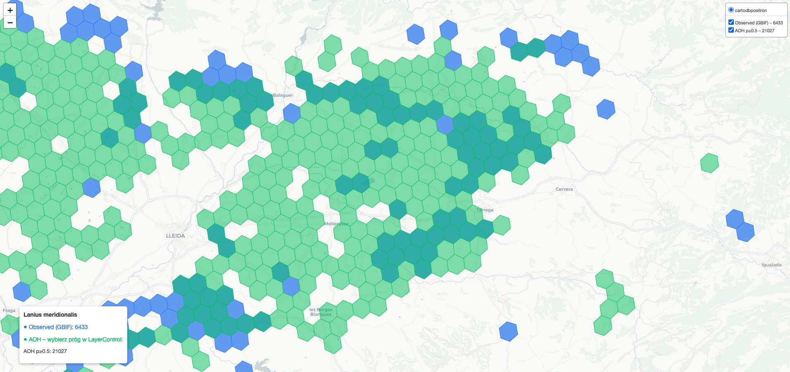

# GBIF Species Predictor

Multi-label machine learning system that predicts which **threatened and vulnerable species** (IUCN CR, EN, VU) are likely present in an H3 hexagonal grid cell in Spain. The project combines GBIF occurrence data with environmental features (terrain, land cover, OSM) to train classifiers and produces **Area of Habitat (AoH-proxy)** maps for species conservation.

**Output:** Top-N species with probabilities per hex: `[{"species_id": ..., "name": ..., "p": 0.99}, ...]`

---

## Table of Contents

1. [Datasets](#1-datasets)
2. [Experiment Design](#2-experiment-design)
3. [Model Architectures](#3-model-architectures)
4. [Model Results](#4-model-results)
5. [Model Testing](#5-model-testing)
6. [Area of Habitat (AoH-proxy)](#6-area-of-habitat-aoh-proxy)
7. [Usage](#7-usage)

---

## 1. Datasets

All datasets are stored in S3 (`ie-datalake` bucket) as Parquet files, partitioned by country, year, and H3 resolution. We use **Spain (ES)** and **H3 resolution 7** (~5.16 km² per hex).

| Dataset | S3 Path | Description |
|---------|---------|-------------|
| **gbif_species_h3_mapping** | `gold/gbif_species_h3_mapping` | Hex–species occurrence mapping. Each row: `country`, `h3_index`, `taxon_key` (species_id), `year`, `occurrence_count`, `is_threatened`, `is_invasive`, `iucn_category`. Aggregates GBIF observations per hex per species per year. |
| **gbif_species_dim** | `gold/gbif_species_dim` | Species dimension table: `species_id`, `species_name`. Used for human-readable labels. |
| **osm_hex_features** | `gold/osm_hex_features` | OSM-derived features per hex: `road_count`, `major_road_count`, `road_count_per_km2`, `port_feature_count`, `airport_feature_count`, `urban_footprint_area_pct`, `building_area_pct`, `protected_area_pct`, `building_count`, `waterbody_area_pct`, `wetland_area_pct`, `human_footprint_area_pct`, `natural_habitat_area_pct`, `dist_to_coast_m`, `dist_to_major_road_m`. |
| **gbif_cell_metrics** | `gold/gbif_cell_metrics` | Per-hex observation effort: `observation_count` (or `obs_count_all`), `dqi` (data quality index). Used for effort-aware evaluation and optional occurrence features. |
| **nature2000_cell_protection** | `gold/nature2000_cell_protection` | Natura 2000 protection: `is_protected_area`, `nearest_protected_distance`. |
| **gee_hex_terrain** | `gold/gee_hex_terrain` | Terrain and land cover from Google Earth Engine: `elevation_mean`, `slope_mean`, `lc_*_pct` (Copernicus CGLS land cover proportions: forest, crops, urban, water, etc.). Snapshot year 2019. |

---

## 2. Experiment Design

### 2.1 Spatial Unit: H3 Hexagons

We use **H3 resolution 7** (~5.16 km² per cell) for Spain. H3 provides a hierarchical, equal-area hexagonal grid that avoids edge effects and supports spatial aggregation. Each hex has a unique `h3_index` string.

### 2.2 Target Species Selection

- **Top 10 threatened species** by total occurrence count in Spain (2015–2024).
- **Threatened** = IUCN category Critically Endangered (CR), Endangered (EN), or Vulnerable (VU), or `is_threatened=True` in the data.
- **Lanius meridionalis** (Southern Grey Shrike, species_id 7341500) is **always included** in the target list (replaces the 10th species if not in top 9).
- Current target species: Lanius meridionalis, Aythya ferina, Streptopelia turtur, Ichthyaetus audouinii, Neophron percnopterus, Pluvialis squatarola, Otis tarda, Aquila adalberti, Oxyura leucocephala.

### 2.3 Which Hexes Go Into Training?

We take **all hexes that have at least one record** of any of our 10 threatened species (with `occurrence_count >= 2`) in the years 2018–2024. We do **not** filter by "200 species" or "200 observations" for training. A hex is included if it appears in the GBIF mapping for at least one of our target species in the training, feature, or evaluation windows. Each such hex gets a row in the dataset: for the 10 species, we have Y = 1 where present, Y = 0 where absent (or not recorded). So we have both positive and negative labels per hex.

The **200 threshold** (`obs_count_all >= 200`) refers to **total observations** in the hex (all species combined), not number of species. It is used **only for evaluation** (mask-and-recover, high-effort subset)—not for selecting training hexes. It helps focus evaluation on well-sampled hexes where absence is more trustworthy.

### 2.4 Target Variable (Y)

- **Y (training target):** Binary presence matrix `(n_hexes × n_species)`. `Y[i, j] = 1` if species `j` was observed in hex `i` during **Y_TRAIN_YEARS (2018–2023)** with `occurrence_count >= PRESENCE_THRESHOLD` (default 2).
- **Y_eval (evaluation target):** Same structure, but presence in **PREDICT_YEAR (2024)**. Used for test-set evaluation.
- **Presence threshold:** A hex counts as "present" for a species only if `occurrence_count >= 2` in that hex-year, reducing noise from single incidental records.

### 2.5 Features (X)

**40 features** when `USE_OCCURRENCE_FEATURES=False` (default):

| Category | Features |
|----------|----------|
| **OSM** | `road_count`, `major_road_count`, `road_count_per_km2`, `port_feature_count`, `airport_feature_count`, `urban_footprint_area_pct`, `building_area_pct`, `protected_area_pct`, `building_count`, `waterbody_area_pct`, `wetland_area_pct`, `human_footprint_area_pct`, `natural_habitat_area_pct`, `dist_to_coast_m`, `dist_to_major_road_m` |
| **Natura 2000** | `is_protected_area`, `nearest_protected_distance` |
| **Terrain (GEE)** | `elevation_mean`, `slope_mean` |
| **Land cover (GEE)** | `lc_*_pct` (e.g. `forest_evergreen_broad_pct`, `crops_pct`, `urban_pct`, `shrubs_pct`, etc.) – Copernicus CGLS classes |

If `USE_OCCURRENCE_FEATURES=True`, we add: `log_obs_count`, `dqi`, `neighbor_log_obs_mean`, and historical presence flags `in_hex_last5y`, `in_k1_last5y`, `in_k2_last5y` per species (k1/k2 = presence in k-ring neighbors). We use **False** to avoid leakage and focus on environmental predictors.

### 2.6 Train/Val/Test Split: Spatial Block Split

To avoid **spatial autocorrelation leakage** (nearby hexes share similar conditions and labels), we split by **parent H3 block** at resolution 5:

- Each hex is assigned `block_id = h3.cell_to_parent(h3_index, 5)`.
- Blocks are shuffled (seed 42) and split: **70% train**, **15% val**, **15% test**.
- All hexes in a block go to the same split. The model never sees test-block hexes during training.

### 2.7 Preprocessing

- Features are **StandardScaler**-normalized (fit on train, transform val/test).
- Missing values and inf replaced with 0; values clipped to `[-1e15, 1e15]` to avoid float overflow.

---

## 3. Model Architectures

We compare four approaches:

### 3.1 Multi-Label MLP (PyTorch)

- **Architecture:** `MultiLabelMLP`: Linear → BatchNorm → ReLU → Dropout(0.3) → Linear → … → Linear (logits). Hidden sizes `[256, 128]`.
- **Output:** One logit per species; sigmoid for probabilities.
- **Loss:** `BCEWithLogitsLoss` with `pos_weight` (per-class imbalance: `n_neg / n_pos`).
- **Optimizer:** Adam, lr=1e-3.
- **Training:** Early stopping on validation macro PR-AUC (patience 25, max 200 epochs).

### 3.2 K-Nearest Neighbors (K-NN)

- **Method:** Cosine similarity between test hex and train hexes; average of K=5 neighbors’ binary labels as probability.
- **No training;** purely instance-based.

### 3.3 LightGBM

- **MultiOutputClassifier** with one binary classifier per species.
- **Params:** `n_estimators=200`, `learning_rate=0.05`, default tree params.

### 3.4 XGBoost (Primary Model)

- **MultiOutputClassifier** with one `XGBClassifier` per species.
- **GridSearchCV** on first species: `n_estimators` ∈ {100, 200}, `max_depth` ∈ {4, 6, 8}, `learning_rate` ∈ {0.05, 0.1}, `min_child_weight` ∈ {1, 3}. Best params applied to full multi-output model.
- **Typical best params:** `learning_rate=0.05`, `max_depth=4`, `min_child_weight=3`, `n_estimators=100`.
- **Saved to:** `output/species_predictor_xgb.pkl` (model, scaler, feature_cols). Used for showcase maps and AoH.

### 3.5 SHAP Interpretability – Lanius meridionalis

We use **SHAP TreeExplainer** on the XGBoost classifier for Lanius meridionalis (Southern Grey Shrike) to identify which features drive predictions. Top 10 features by mean |SHAP| and their direction of effect:

| Rank | Feature | Effect | Rationale |
|------|---------|--------|-----------|
| 1 | `elevation_mean` | **+** | Shrikes prefer elevated, open terrain (hills, plateaus) typical of Mediterranean Spain. Higher elevation correlates with suitable habitat. |
| 2 | `shrubs_pct` | **+** | Scrubland and low woody vegetation provide perching sites and foraging habitat. Core habitat type for the species. |
| 3 | `herbaceous_pct` | **+** | Open grasslands and herbaceous cover support prey (insects, small vertebrates) and hunting behavior. |
| 4 | `crops_pct` | **+** | Agricultural mosaics (olive groves, vineyards, dry farming) create edge habitat; shrikes often use field margins. |
| 5 | `natural_habitat_area_pct` | **+** | Less human-modified areas retain suitable structure; correlates with presence in semi-natural landscapes. |
| 6 | `urban_pct` | **−** | Urban and built-up areas are avoided; shrikes need open space and perches, not dense urbanization. |
| 7 | `human_footprint_area_pct` | **−** | Higher human footprint indicates disturbance; the species is sensitive to habitat fragmentation. |
| 8 | `forest_evergreen_broad_pct` | **−** | Dense evergreen forest lacks open structure; shrikes require clear sight lines for hunting. |
| 9 | `slope_mean` | **+** | Moderate slope adds terrain diversity (ridges, valleys); often associated with scrub and open habitats. |
| 10 | `is_protected_area` | **+** | Natura 2000 and protected areas often preserve suitable scrubland and steppe; positive signal for presence. |

*Positive SHAP → higher feature value increases predicted probability of presence. Negative SHAP → higher value decreases it. The model aligns with known ecology: open, shrubby, agricultural, and elevated habitats favour Lanius meridionalis; urban and dense forest do not.*

---

## 4. Model Results

### 4.1 General Results (Test Set)

| Model | Macro PR-AUC | Micro PR-AUC | R@1 | R@2 | R@3 | R@5 | R@10 | P@1 | P@5 | P@10 |
|-------|--------------|--------------|-----|-----|-----|-----|------|-----|-----|------|
| **MLP** | 0.286 | 0.263 | 0.752 | 0.833 | 0.898 | 0.972 | 1.000 | 0.247 | 0.121 | 0.067 |
| **K-NN** | 0.198 | 0.209 | 0.740 | 0.841 | 0.898 | 0.960 | 1.000 | 0.243 | 0.118 | 0.067 |
| **LightGBM** | 0.312 | 0.316 | 0.771 | 0.878 | 0.940 | 0.987 | 1.000 | 0.283 | 0.127 | 0.067 |
| **XGBoost** | **0.316** | **0.314** | **0.771** | **0.872** | **0.936** | **0.990** | 1.000 | **0.281** | **0.128** | 0.067 |
| Most frequent | 0.074 | 0.129 | 0.659 | 0.753 | 0.839 | 0.929 | 1.000 | 0.152 | 0.109 | 0.067 |

- **R@K:** Recall@K – fraction of true present species found in top-K predictions per hex.
- **P@K:** Precision@K – fraction of top-K predictions that are truly present.
- **XGBoost** achieves the best macro/micro PR-AUC and is used for downstream AoH and showcase maps.

**Most frequent baseline:** Species are ranked by total presence count in the training set (`Y_train.sum(axis=0)`). For every hex, the model predicts the same ordering: the most frequent species gets probability 1.0, the second 0.99, the third 0.98, and so on down to 0.91 for the top 10. No hex features are used—the prediction is identical for all hexes. We use this as our **baseline** because it represents the best guess without any environmental information: "when in doubt, predict the most common species first." It establishes a floor for performance; ML models that beat it demonstrate that terrain, land cover, and OSM features add predictive value beyond simple prevalence.

**Why XGBoost outperforms the baseline:** The baseline does reasonably well on R@1 and P@1 (0.659 and 0.152) because it always predicts the most frequent species first—a strategy that works when that species appears in many hexes. However, it fails on Macro and Micro PR-AUC (0.074 and 0.129) because it assigns the same probability to every hex for each species; it has no ability to rank "hexes where species X is present" above "hexes where it is absent." XGBoost, by contrast, uses elevation, land cover, OSM, and Natura 2000 features to discriminate: it assigns higher probabilities to hexes whose environmental conditions match where each species was observed in training. This yields much better PR-AUC (0.316 / 0.314) and stronger R@1/P@1 (0.771 / 0.281). The gap in PR-AUC shows that XGBoost learns meaningful habitat associations; the gap in top-K metrics shows it also improves practical ranking for conservation applications.


### 4.2 Per-Species Results (Sample)

| Species | n_observed | PR-AUC | Precision | Recall | F1 |
|---------|------------|--------|-----------|--------|-----|
| Ichthyaetus audouinii | 248 | 0.776 | 0.777 | 0.702 | 0.737 |
| **Lanius meridionalis** | 833 | **0.651** | **0.632** | **0.564** | **0.596** |
| Neophron percnopterus | 535 | 0.586 | 0.715 | 0.295 | 0.418 |
| Streptopelia turtur | 729 | 0.553 | 0.618 | 0.277 | 0.383 |
| Otis tarda | 190 | 0.550 | 0.600 | 0.268 | 0.371 |
| Pluvialis squatarola | 125 | 0.494 | 0.605 | 0.392 | 0.476 |
| Aythya ferina | 145 | 0.378 | 0.458 | 0.186 | 0.265 |
| Aquila adalberti | 259 | 0.346 | 0.667 | 0.008 | 0.015 |

### 4.3 Lanius meridionalis – Focal Species

**Lanius meridionalis** (Southern Grey Shrike) is our primary showcase species. Results on the test set:

| Metric | Value |
|--------|-------|
| **PR-AUC** | 0.651 |
| **Precision** | 63.2% |
| **Recall** | 56.4% |
| **F1** | 0.596 |
| **Observed hexes (test)** | 833 |
| **True Positives** | 470 |
| **False Positives** | 274 |
| **False Negatives** | 363 |

---

## 5. Model Testing

### 5.1 Evaluation Protocol

1. **Spatial block split:** Test hexes come from blocks never seen during training.
2. **Evaluation year:** Labels are from **2024** (PREDICT_YEAR); training uses 2018–2023.
3. **Metrics:** Macro/Micro PR-AUC, Recall@K, Precision@K. Per-species: PR-AUC, precision, recall, F1 (species with ≥50 observed hexes).
4. **Effort threshold (optional):** For mask-and-recover and some analyses, we restrict to hexes with `obs_count_all >= 200` to focus on well-sampled areas.

### 5.2 Test Set Predictions for Lanius meridionalis

The showcase map visualizes model predictions on the test set for Lanius meridionalis:

- **Green (Correct / TP):** Hexes where the model predicted presence and the species was observed (470 hexes).
- **Red (Wrong / FP):** Hexes where the model predicted presence but the species was not observed (274 hexes).
- **Orange (Missed / FN):** Hexes where the species was observed but the model did not predict presence (363 hexes).



*Test set predictions for Lanius meridionalis. Green = True Positives, Red = False Positives, Orange = False Negatives. Accuracy 56.4%, Precision 63.2%, Recall 56.4%.*

---

## 6. Area of Habitat (AoH-proxy)

### 6.1 Concept

**Area of Habitat (AOH)** is an IUCN/BirdLife concept: habitat available for the species within its range. Classical AOH uses deductive rules (IUCN habitat preferences, elevation limits, land cover). Our approach is **inductive**: the ML model learns from GBIF occurrences and environmental features to predict suitable habitat.

### 6.2 Our AoH-proxy Algorithm

1. **Observed (GBIF):** Hexes where the species was recorded with `occurrence_count >= 2` (2018–2024). This is the **ground truth** of where the species occurs.
2. **Area of Habitat:** Hexes where the XGBoost model predicts presence with probability **p ≥ 0.5** (configurable). We run prediction on **all Spain** (~95,000 res-7 hexes) using the same feature pipeline (OSM, GEE terrain, Nature2000, cell metrics).
3. **Interpretation:** AoH extends beyond observed hexes by interpolating based on environmental similarity. It represents **potential habitat** where the species might occur but has not been recorded.

### 6.3 Lanius meridionalis – Observed vs AoH

**Observed occurrences (GBIF):** 6,433 hexes where Lanius meridionalis has been recorded.



*Blue hexagons: Observed (GBIF) occurrences of Lanius meridionalis (6,433 hexes).*

**Area of Habitat (p ≥ 0.5):** 21,027 hexes predicted as suitable habitat. The model interpolates from observed areas to environmentally similar regions.



*Blue = Observed (GBIF). Green = Area of Habitat (model prediction p > 0.5). The green layer shows where the model predicts suitable habitat beyond direct observations.*

**Overlap:** ~3,294 hexes are both observed and predicted (AoH largely encompasses observed areas and extends into adjacent suitable habitat).

### 6.4 Methodology References

- Brooks et al. (2019) *Trends Ecol Evol* – AOH methodology.
- Lumbierres et al. (2022) *Nature Scientific Data* – AOH applications.
- BirdLife International – code_for_AOH.

---

## 7. Usage

### 7.1 Prerequisites

```bash
pip install pandas numpy scikit-learn torch h3 pyarrow boto3 lightgbm xgboost shap matplotlib folium
```

Configure AWS credentials for S3 access (`ie-datalake`).

### 7.2 Workflow

1. **Train and evaluate:** Run `01_species_predictor.ipynb` (all cells). Produces:
   - `output/species_predictor_xgb.pkl` – XGBoost model
   - `output/species_predictor.pt` – MLP checkpoint
   - `output/species_predictor_lgbm.pkl` – LightGBM model
   - `output/target_species.csv` – species mapping
   - `output/scaler.pkl` – feature scaler
   - `output/showcase_data.pkl` – test data for showcase/AoH

2. **Showcase map:** Run `02_species_showcase_map.ipynb`. Produces `output/species_showcase_7341500.html` (Lanius meridionalis).

3. **Area of Habitat:** Run `03_area_of_habitat.ipynb`. Produces `output/area_of_habitat_7341500.html` (full Spain AoH for Lanius meridionalis).

### 7.3 Configuration (01_species_predictor.ipynb)

| Config | Default | Description |
|--------|---------|-------------|
| `Y_TRAIN_YEARS` | (2018, 2023) | Y = presence in this window |
| `PREDICT_YEAR` | 2024 | Evaluation target year |
| `FEATURE_YEARS` | (2019, 2023) | Years for feature context (no leakage) |
| `USE_OCCURRENCE_FEATURES` | False | If False: only land cover, elevation, OSM |
| `PRESENCE_THRESHOLD` | 2 | Min occurrence_count for presence |
| `N_THREATENED` | 10 | Number of target species |
| `MIN_OCCURRENCES` | 50 | Per-species eval: min observed hexes |

### 7.4 Design Notes

- **GBIF presence-only / sampling bias:** GBIF records where species were observed, not true absences. Hexes with no records may be under-sampled. The model learns "where we tend to see species X" rather than true absence.
- **Spatial block split:** Mandatory to avoid leakage from nearby hexes.
- **SHAP interpretability:** XGBoost TreeExplainer for Lanius meridionalis shows which features (elevation, land cover, OSM) drive predictions.
